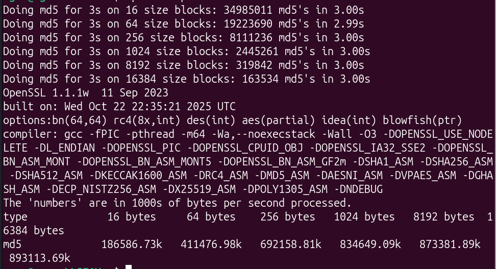
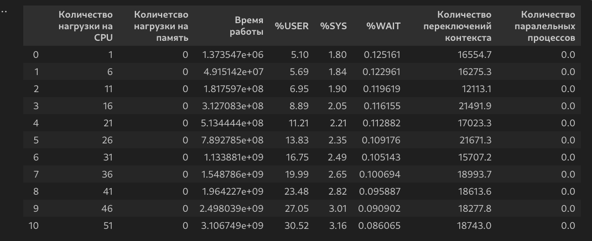
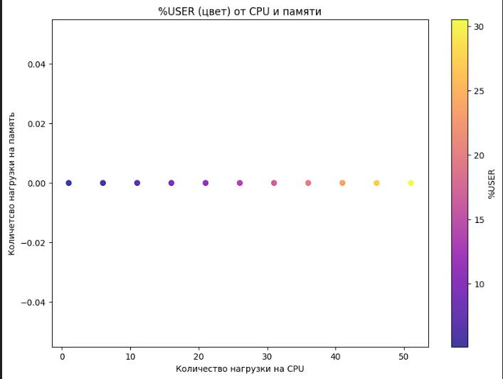
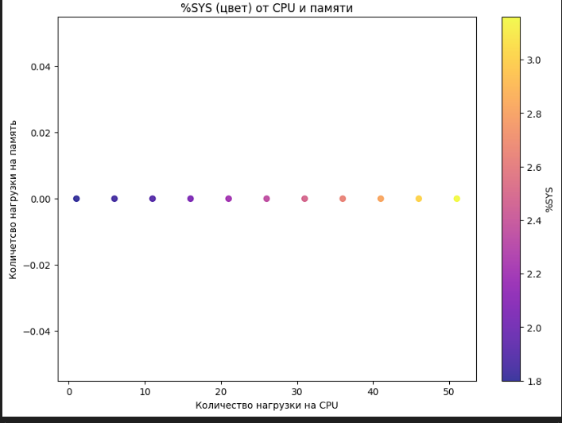
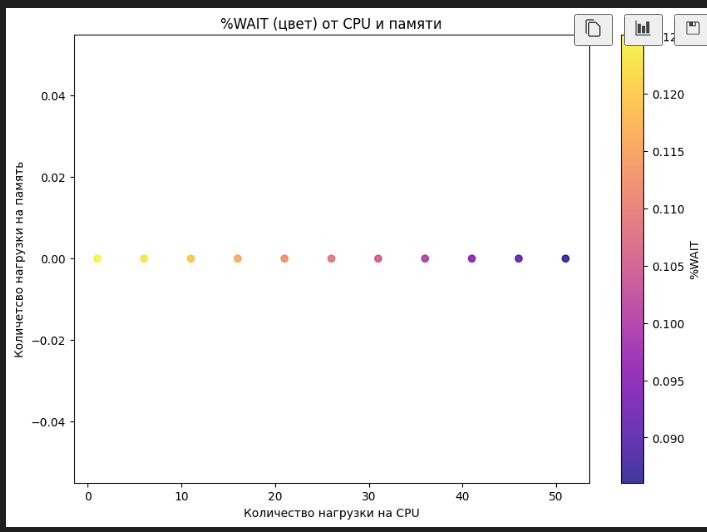
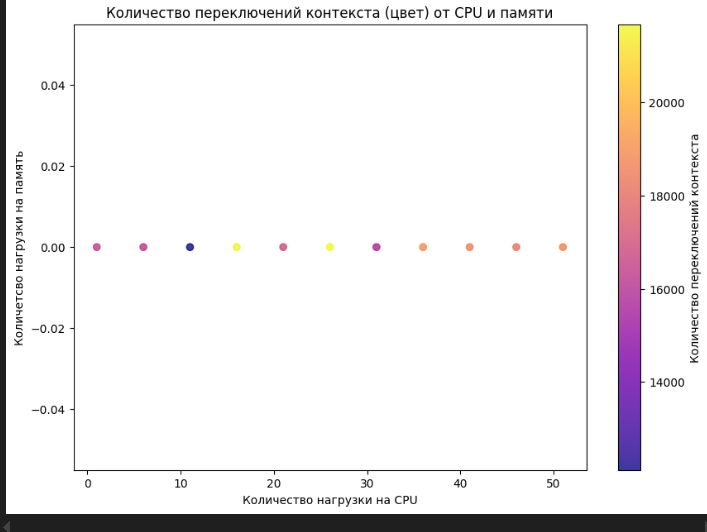
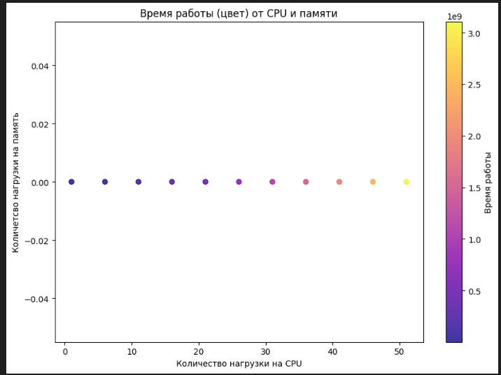
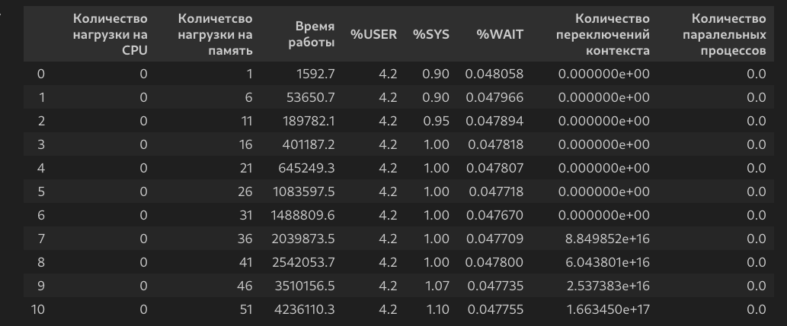
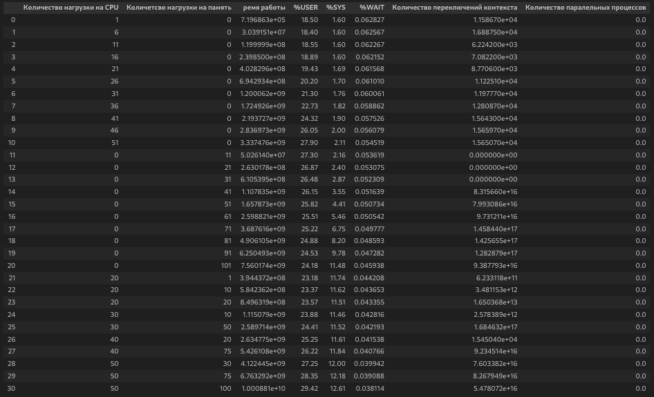

# Базовая лабораторная работа 1

### Введение
---
Базовый пользовательский интерфейс операционной системы — это терминал, с его помощью можно взаимодействовать с ОС, давать ей команды и запускать программы и наблюдать результат их выполнения. А имея возможность запускать программы, можно расширить возможности данной ОС. В данной лабораторной работе вам предлагается реализовать простую командную оболочку наподобие Bash вместе с несколькими вспомогательными утилитами для проверки работоспособности разработанного приложения и исследования поведения операционной системы.

### Часть 1. Запуск программ
---
Необходимо реализовать собственную оболочку командной строки — shell. Shell должен предоставлять пользователю возможность запускать программы на компьютере с переданными аргументами командной строки и отображать время их выполнения (рассчитать как разность времени завершения и времени запуска).

### Часть 2. Логические операторы
---
В разработанное приложение командной оболочки необходимо добавить поддержку логических операторов (аналогичных операторам из Bash) согласно выданному варианту:

`&&` — логическое И (AND),
`||` — логическое ИЛИ (OR),
`;` — последовательное выполнение,
`&` — выполнение в фоне.
### Часть 3. Анализ системы и мониторинг
---
Разработайте параметризируемую программу-нагрузчик, которая будет однопоточно нагружать подсистему ввода-вывода (IO). Она должна принимать на вход следующие параметры:

`rw: read/write` — режим нагрузки: чтение или запись;
`block_size: <number>` — размер блока в байтах, с которым производится чтение/запись;
`block_count: <number>` — количество блоков;
`file: <path string>` — имя файла, с которым происходит работа;
`range: <number>-<number>` — границы в пределах файла, в которые должны осуществляться запись/чтение, значение по умолчанию, 0-0, означает, что доступен весь файл;
`direct: on/off` — открывать файл с опцией O_DIRECT (в обход кэшей ОС) или нет;
`type: sequence/random` — режим выбора следующего блока для записи/чтения: последовательно или случайно;

Разработайте комплекс программ-нагрузчиков согласно выданному варианту. Каждый нагрузчик должен принимать параметр, который определяет количество повторений для алгоритма, указанного в задании, а также другие вспомогательные параметры. Варианты программ рассчитаны так, чтобы по-разному нагружать вычислительную подсистему (CPU) и подсистему ввода-вывода (IO) — это необходимо учитывать при их реализации. Разработанные программы необходимо скомпилировать без дополнительных опций оптимизации компилятора.

Проведите исследование поведения ОС во время исполнения разработанных программ-нагрузчиков по следующему плану:

Перед запуском нагрузчика попробуйте оценить время работы вашей программы или ее результаты (если по варианту вам досталось измерение чего-либо) и обоснуйте свои предположения.

Запустите программу-нагрузчик и зафиксируйте метрики ее работы с помощью инструментов для мониторинга и профилирования (см. лекции). Сравните полученные результаты с ожидаемыми. Объясните наблюдаемое поведение. Продолжительность каждого запуска должна занимать достаточное для прекращения переходных процессов время, по крайней мере, минуту.

Определите количество одновременно запущенных процессов с программой-нагрузчиком, которое эффективно нагружает все ядра процессора в вашей системе. Как распределяются показатели времени USER%, SYS%, WAIT%, а также полное время выполнения нагрузчика, какое количество переключений контекста (вынужденных и невынужденных) происходит при этом? Подумайте над тем, как вы определяете эффективность.

Увеличьте количество нагрузчиков вдвое, втрое, вчетверо. Как изменились исследуемые показатели? Почему?

Объедините программы-нагрузчики в одну, реализованную при помощи потоков выполнения, чтобы один нагрузчик эффективно нагружал все ядра вашей системы. Как изменились показатели времени для того же объема вычислений? Запустите одну, две, три таких программы. Как изменились исследуемые показатели? Почему?

Скомпилируйте программу-нагрузчик с опцией агрессивной оптимизации. Как изменились исследуемые показатели? На сколько сократилось реальное время исполнения программы-нагрузчика? Почему?

В процессе защиты вашей работы преподаватель будет просить вас запустить программу-нагрузчик с различными комбинациями параметров и просить объяснить результат.

### Требования к реализации
---
Программа (комплекс программ) должна быть реализована на языке C.

Дочерние процессы должны быть созданы через указанные в варианте системные вызовы операционной системы, с обеспечением корректного запуска и завершения процессов. Запрещено использовать высокоуровневые абстракции над системными вызовами. Необходимо использовать процедуры libc.


# Части 1 и 2. Shell.c

`Shell.c` — реализация командной оболочки. 

Содержит следующие функции:

- `execute_command` — выполняет системную команду без ожидания входных данных со stdin;
- `execute_command_with_stdin` — выполняет системную команду со stdin.

### Реализация
---
##### execute_command

1) Обрежем пробелы в начале и конце команды.
```
while (*cmd == ' ') cmd++; // Сдвигаем указатель на первый непробельный символ
    char *end = cmd + strlen(cmd) - 1; 
    while (end > cmd && *end == ' ') *end-- = '\0';
```

2) Создаем дочерний процесс.
```
pid_t pid = vfork();

```
3) В дочернем процессе выполняем команду. Ошибки перенаправляем из stderr в `/dev/null`. В родительском процессе ждем завершения дочернего и проверяем статус выполнения. Выводим `Command not found`, если статус не равен 0. Подавление ошибок отсутствует, чтобы можно было выполнять команды типа `cat test.txt` и они выводили содержимое файла. Также будут отображаться стандартные ошибки.

```
if (pid == 0) {
        
        execlp("sh", "sh", "-c", cmd, NULL);
        exit(127);
} else if (pid > 0) { // Ждет завершение дочернего процесса
    int status;
    waitpid(pid, &status, 0);
    
    if (WIFEXITED(status) && WEXITSTATUS(status) != 0) { // Проверка статуса
        printf("Command not found\n");
    }
}
```

##### execute_command_with_stdin

1) Создаем канал.
```
int pipefd[2];
pipe(pipefd);
```

2) Создаем дочерний процесс.
```
pid_t pid = vfork();
```
3) В дочернем процессе закрываем канал для записи (канал 1) `close(pipefd[1]);` и перенаправляем stdin в канал `dup2(pipefd[0], STDIN_FILENO);`. Закрываем канал для чтения `close(pipefd[0]);`. Выполняем команду `execlp("sh", "sh", "-c", cmd, NULL);`. А в родительском процессе закрываем канал для чтения (канал 0), записываем в канал (канал 1) и ждем завершение дочернего процесса. Проверяем статус выполнения. Выводим `Command not found`, если статус не равен 0.

```
if (pid == 0) {
    close(pipefd[1]);
    dup2(pipefd[0], STDIN_FILENO);
    close(pipefd[0]);
    
    
```

### Итог. Часть 1. Shell.c
Реализована командная оболочка.

Оболочка поддерживает `AND`. Поддержка `\n`.


# Часть 3. Нагрузчики

Были реализованы два нагрузчика:
- `CpuLoader.c` — нагрузчик на процессор. Нагружает с помощью подсчета хеша md5.
- `MemoryLoader.c` — нагрузчик на память, нагружает память чтением и записью в файл, а также заменой одного значения на другое.

Разберем реализацию по порядку.

## Нагрузчик на процессор
---
За нагрузку отвечает `CpuLoader.c`.


В коде реализованы три функции:
- `process_monitor_thread` — функция мониторинга числа процессов. Учитывает только те процессы, что не являются дочерними.
- `get_cpu_stats_from_proc` — функция для мониторинга процессора, в которой используется `/proc/stat`.
- `cpu_monitoring` — функция для мониторинга процессора. Вызывается в отдельном потоке.
- `inefficient_md5` — функция вычисления хеша md5.
- `create_text` — генерирует текст из фрагментов, что читаются из файла.
- `cpu_loader` — основная функция, запускающая нагрузку на процессор.

Начнем с определения структур данных.

### Структуры данных

Структуры данных создаются с помощью `typedef struct` и используются для хранения. По сути, это как data-классы в Kotlin/Java. Но содержат чисто поля, которые по умолчанию изменяемые.

Пример:
```
typedef struct
{
    double user;
    double system;
    double wait;
    unsigned long context_switches;
} cpu_stats_t;
```

Присутствуют следующие структуры данных:
- `cpu_stats_t` — структура для хранения многовенной статистики процессора. Имеются такие поля: `user` — доля времени cpu, потраченное на пользовательские процессы, `system` — доля времени cpu, потраченное на системные процессы, `wait` — доля времени cpu, потраченное на ожидание, `context_switches` — количество переключений контекста.
- `monitoring_result_t` — структура для хранения средних результатов мониторинга. Имеет поля: `user_avg` — средняя доля времени cpu, потраченное на пользовательские процессы, `system_avg` — средняя доля времени cpu, потраченное на системные процессы, `wait_avg` — средняя доля времени cpu, потраченное на ожидание, `context_switches_total` — общее количество переключений контекста, `context_switches_delta` — количество переключений контекста за последний интервал времени.

- `process_monitor_t` — структура для хранения информации о количестве параллельных процессов. Имеет поля: `volatile int monitor` — флаг активности мониторинга, `int max_processes` — максимальное количество параллельных процессов.

### Функции

#### process_monitor_thread

Функция для мониторинга количества параллельных процессов.

Использует структуру `process_monitor_t` для хранения информации о количестве параллельных процессов. 
За измерение одно делает три проверки. 

Для сбора информации используются простые системные вызовы: `ps -e -o pid= | wc -l` и `pgrep -f '^\\.\\/loaders$'`


- `ps -e -o pid= | wc -l` — выводит общее число процессов. `ps` — показывает все процессы, `-e` — показывает процессы, не только запущенные в терминале, `-o pid=` — выводит только pid процессов, `wc -l` — считает количество строк.
- `pgrep -f '^\\.\\/loaders$'` — выводит pid процесса, который запущен с именем `loaders`. `pgrep` — поиск процесса по имени, `-f` — поиск по имени файла, `'^\\./loaders$'` — ищет процессы, которые запущены с именем `loaders`

Логика простая:
1) Находим общее число процессов.
2) Находим число процессов, которые запущены с именем `./loaders`.
3) Находим разницу между двумя числами.
4) Дальше в зависимости от цели можем вернуть количество общих процессов, количество процессов запущенных с именем loaders или количество процессов, что запущены не с именем `./loaders`.


Эта разница и есть количество параллельных процессов, что запущены одновременно с программой и ее дочерними процессами.

Примечание:  `./loaders` - это команда запуска скомплированной программы `Loaders.c` с именем `loaders`.


#### get_cpu_stats_from_proc
Для хранения фрагментов имеется `array` — двумерный массив, в котором хранится максимально 10000 фрагментов длиной не больше 150. Также выделяется память под итоговую строку `text` размером 500001. 

Также используется массив `used` для отслеживания использованных фрагментов. `0` — не использован, `1` — использован.

С помощью `rand()` мы генерируем рандомный индекс для фрагмента. Если фрагмент не использован, то добавляем его в строку `text`. Если длина строки `text` больше 500000, то выходим из цикла.


#### cpu_loader

Основная функция для запуска нагрузки. 

Функция принимает указатель на переменные, куда потом сохранятся результаты измерений параметров. Также передается уже готовый текст для хеширования.

1) Идет инициализация. Всем переменным присваивается по умолчанию значение `0`.

2) Инициализируем мониторинг процессов, установив флаг 1 и максимальное число процессов 0:
```
process_monitor_t process_monitor = {
    .monitoring = 1,
    .max_processes = 0
};
```
3) Создаем и запускаем поток для мониторинга процессов `process_monitor_thread_id`. Создаем флажок запуска мониторинга:
```
pthread_t process_monitor_thread_id;
    int monitor_created = 0;
    
    if (pthread_create(&process_monitor_thread_id, NULL, process_monitor_thread, &process_monitor) == 0) {
        monitor_created = 1;
    }
```
3) То же самое делаем для мониторинга CPU:
```
pthread_t monitoring_thread;
monitoring_result_t* monitoring_result = NULL;

if (pthread_create(&monitoring_thread, NULL, cpu_monitoring, NULL) != 0) {
    // Если не удалось создать поток мониторинга, продолжаем без него
    monitoring_thread = 0;
}
```
4) Запускаем таймер: `clock_t start = clock();`
5) Запускаем вычисление хеша: `inefficient_md5(text, hash);`
6) Останавливаем таймер: `clock_t end = clock();`
7) Закрываем потоки мониторинга:

8) Обрабатываем результаты:
```
*user_avg = monitoring_result->user_avg;
*system_avg = monitoring_result->system_avg;
*wait_avg = monitoring_result->wait_avg;
// *context_switches_total = monitoring_result->context_switches_total;
*context_switches_delta = monitoring_result->context_switches_delta;
```
9) Возвращаем время работы вычисления хеша — это и есть время нагрузки на cpu. 


## Нагрузчик на память

Нагрузчик на память — это программа, которая у нас будет нагружать дисковую память (ВАЖНО — не операционную память) за счет чтения и записи в файл. Для вычисления метрик программа использует уже готовые функции из `CpuLoader.c` — `process_monitor_thread` и `cpu_monitoring`. Суть в том, что нет смысла вновь реализовывать их, так как они уже реализованы в `CpuLoader.c`. Соответственно, программа использует и те же структуры данных, что и в `CpuLoader.c`.

Программа-нагрузчик расположена в файле `MemoryLoader.c`. 

Реализует следующие функции:

- `memory_work` — функция, которая выполняет нагрузку на память. Принимает на вход число и массив, в котором будет храниться результаты нагрузки. Возвращает время замены числа и время записи в файл.
- `memory_loader` — функция, которая запускает нагрузку на память. Принимает на вход число и указатели для хранения результатов сбора метрик состояния процессора.

Но есть одна особенность. `%WAIT` — это метрика, которая будет измериться, например, при вводе/выводе, чтении/записи. Однако при первом чтении файла файл будет сохранен в кеш, и в дальнейшем он не представляет нагрузки, потому и метрика будет нулевой. Потому идет блокировка кеша на уровне библиотеки stdio и на уровне ядра Linux:

- `setbuf(ptr, NULL)` — отключения буферизации файла, чтоб считывалось реальное время чтения.
- `posix_fadvise(fd, 0, 0, POSIX_FADV_DONTNEED | POSIX_FADV_SEQUENTIAL);` — обращение к ядру Linux с рекомендацией о том, что данные больше не понадобятся (`POSIX_FADV_DONTNEED`), и что данные будут читаться последовательно (`POSIX_FADV_SEQUENTIAL`).

Использование обоих вариантов блокировки дает надежность, что файл не будет кешироваться. 

Дальше по логике программы замеряет время чтения файла, а также в параллельных потоках замеряет все метрики, как и в ситуации с cpu. Происходит рандомное чтение определенного числа строк (чисел) из файла. Это нужно, чтоб система на могла сама предугадывать чтение, что снижало бы нагрузку. 

Используется метод `use_data`. Он не несете полезной нагрузки, но нужен, чтобы система не могла вырезать не используетмые данные, что так же бы снизило нагрузку.

Те же самые замеры происходят и во время работы замены и записи в файл.

Записываем все данные в указатели, что были переданы в функцию.


## Объединение

Оба нагрузчика объединены в файл `Loaders.c`

Основная задача программы - это запуск программ-нагрузчиков в разных пропорциях и получения сведений о времени параметров ОС за время работы всех нагрузчиков. Для этого программа по умолчанию на вход принимает 2-3 аргумента:

1) Количество нагрузчиков на CPU
2) Количество нагрузчиков на память
3) Число для замены в файле (используется в нагрузчике на память). Однако, этот аргумент не ожидается, если число нагрузчиков на память 0

Компиляция:

`gcc Loaders.c CpuLoader.c MemoryLoader.c -o loaders -lpthread -lcrypto`

Пример запуска:

`./Loaders 1 1 1`


В программе реализованы функции:
1) `cpu_loader_thread` - функция, что в потоке запускает нагрузку на cpu. А именно функцию `cpu_loader` из `CpuLoader.c`.
2) `memory_loader_thread` - функция, что в потоке запускает нагрузку на память. А именно функцию `memory_loader` из `MemoryLoader.c`.
3) `main` - функция, что запускает потоки нагрузчиков и ждет их завершения. Также получает результат замеров и находит их среднее значение на все количество нагрузчиков. 


Используется следующая структура данных:

```
typedef struct {
    int thread_id;                /**< Идентификатор потока */
    int number;                   /**< Число для передачи в memory_loader */
    char* text;                   /**< Текст для передачи в cpu_loader */
    clock_t execution_time;       /**< Время выполнения потока */
    double user_avg;              /**< Среднее время в пользовательском режиме */
    double system_avg;            /**< Среднее время в системном режиме */
    double wait_avg;              /**< Среднее время ожидания */
    unsigned long context_switches_total; /**< Общее количество переключений контекста */
    unsigned long context_switches_delta; /**< Изменение количества переключений контекста */
    int parallel_processes;       /**< Количество параллельных процессов */
} thread_data_t;

```

### Реализация потоковых нагрузчиков

В реализации потоковых нагрузчиков нечего особо разбирать. Они инициализируют локальные переменные, указатели на которые затем передаются нагрузчику, куда нагрузчик записывает результаты. А потом эти данные копируются в структуру `thread_data_t`, которая затем передается в `main`.

### Реализация главной функции

Главная функция на вход ожидает параметры:
1) Количество нагрузчиков на CPU
2) Количество нагрузчиков на память
3) Число для замены в файле (используется в нагрузчике на память). Однако, если число нагрузчиков на память 0, то число для замены не используется.

Дальше следующие этапы:

1) Если имеются нагрузчики на cpu, то генерируется текст. 
2) Если имеются нагрузчики на память, то ожидается третий параметр, если нет - то возврат ошибки.
3) Инициализация массивов для хранения данных для потоков и входных данных для нагрузчиков
```
pthread_t cpu_threads[count_cpu_loader];
pthread_t memory_threads[count_memory_loader];
thread_data_t cpu_data[count_cpu_loader];
thread_data_t memory_data[count_memory_loader];
```
4) Запускаем потоки нагрузчиков на CPU с помощью цикла
```
    for (int i = 0; i < count_cpu_loader; i++) {
        cpu_data[i].thread_id = i + 1;
        cpu_data[i].number = number;
        cpu_data[i].text = cpu_text;
        if (pthread_create(&cpu_threads[i], NULL, cpu_loader_thread, &cpu_data[i]) != 0) {
            fprintf(stderr, "Error: failed to create CPU thread %d\n", i);
            return 1;
        }
    }
```
5) Запускаем потоки нагрузчиков на память с помощью цикла
```
if (count_memory_loader > 0) {
    for (int i = 0; i < count_memory_loader; i++) {
        memory_data[i].thread_id = i + 1;
        memory_data[i].number = number;
        if (pthread_create(&memory_threads[i], NULL, memory_loader_thread, &memory_data[i]) != 0) {
            fprintf(stderr, "Error: failed to create Memory thread %d\n", i);
            return 1;
        }
    }
}
```
6) Ждем завершения потоков нагрузчиков на CPU с помощью цикла
```
for (int i = 0; i < count_cpu_loader; i++) {
    pthread_join(cpu_threads[i], NULL);
}
for (int i = 0; i < count_memory_loader; i++) {
    pthread_join(memory_threads[i], NULL);
}
```
7) Собираем результаты из нагрузчиков:
```
// Собираем результаты с нагрузки CPU
for (int i = 0; i < count_cpu_loader; i++) {
    total_cpu_time += cpu_data[i].execution_time;
    total_user_avg += cpu_data[i].user_avg;
    total_system_avg += cpu_data[i].system_avg;
    total_wait_avg += cpu_data[i].wait_avg;
    total_context_switches_delta += cpu_data[i].context_switches_delta;
    total_process += cpu_data[i].parallel_processes;
    
}

//Собираем результаты с нагрузки на память    
for (int i = 0; i < count_memory_loader; i++) {
    total_memory_time += memory_data[i].execution_time;
    total_user_avg += memory_data[i].user_avg;
    total_system_avg += memory_data[i].system_avg;
    total_wait_avg += memory_data[i].wait_avg;
    total_context_switches_delta += memory_data[i].context_switches_delta;
        
```
8) Находим средние значения
9) Выводим результаты и освобождаем память

## Сбор статистики

Для сбора статистики используется программа на Python — `Analitic.py`. Программа на вход ожидает:
1) Количество нагрузчиков на CPU
2) Количество нагрузчиков на память
3) Число для замены в файле (используется в нагрузчике на память). Однако, если число нагрузчиков на память 0, то число для замены не используется.
4) Число запусков для анализа. Это надо для того, чтобы несколько раз запустить программу с одним и тем же количеством нагрузчиков и получить среднее значение. Это сделает результат точнее, так как время от времени программа может работать 1000 мс, а в другой раз 2000 мс. И среднее значение сглаживает такие случайные скачки. 
5) Если один из нагрузчиков не используется, то программа ждет на вход число увеличений другого нагрузчика и шаг. Это позволяет программе в автоматическом режиме увеличивать число нагрузчиков с введенным шагом столько раз, сколько запросит пользователь. Позволяет избавить пользователя несколько раз от ручного ввода количества нагрузчиков.
6) Если используются оба нагрузчика, то неважно, сколько будет задано изначально, программа сама будет подставлять количество нагрузчиков из набора в коде: `steps = [(1, 1), (5, 1), (1, 5), (5, 5), (10, 1), (10, 5), (10, 10), (5, 10), (20, 1), (20, 10), (20, 15), (1, 20), (10, 20)]`

7) Также на вход программа потребует имя файла для записи результатов. Все результаты будут записаны в файл в формате CSV. Будет содержать следующую информацию: `Количество нагрузки на CPU; Количество нагрузки на память; Время работы; %USER; %SYS; %WAIT; Количество переключений контекста; Количество параллельных процессов`. Если файл с таким именем существует, то в него замеры будут дописываться, иначе создастся пустой файл.


## Анализ (программа)
---
Для анализа используется программа на Python — `Analisys.ipynb`. Программа на вход будет ждать только имя файла в формате CSV. Откуда берет информацию и строит графики зависимости каждого из параметров от количества нагрузчиков на процессор и память. Ось X — число нагрузчиков на процессор, ось Y — число нагрузчиков на память, цветовая гамма — один из параметров.  


## Анализ результатов
---

### Анализ нагрузки CPU

Выдвинем гипотезу.
Для начала проанализируем скорость обычного хеширования md5. 

Для этого примем во внимание:
 - Максимальная длина текста составляет 500 000
 - Текст генерируется из ascii, цифр, знаков препинания, unicode и набора `𝄞𝄟𝄠𝄡𝄢`.
 - Ascii, знаки препинания и цифры весят 1 байт (8 бит) на один символ
 - unicode включает кириллицу, латиницу, иероглифы, редкие символы: минимальный вес за один символ - 1 байт (латиница), а максимальный вес за один символ - 4 байта (редкие символы)
 - в наборе `𝄞𝄟𝄠𝄡𝄢` один символ весит 1 байт. 
 
 Значит у нас минимальный объем текст составляет `500 000 байт = 500 000 * 8 бит = 4 000 000 бит`, а максимальный объем текста составляет `500 000 * 4 байта = 2 000 000 байт = 16 000 000 бит`.

 Имеется команда `openssl speed md5` которая запускает серию тестов и измеряет скорость хеширования md5.

На фото представлен результат тестирования хеширования. 
  


 Расшифруем. Например, `Doing md5 for 3s on 16 size blocks: 34985011 md5's in 3.00s` - это значит, что за 3 секунды для блока 16 байтов было выполнено 34985011 хеширований. 

 Вычисления скорости в МБ/с идет по формуле:
 ```
 Скорость (МБ/с) = (количество_хешей × размер_блока_в_байтах) / (время_в_секундах × 1024 × 1024)
```

Например:

```
Скорость (МБ/с) = (34985011 × 16) / (3 × 1024 × 1024) = (примерно) 178 МБ/с 
```

И вычислим среднюю скорость хеширования md5:
```
Обработано байт = количество_хешей × размер_блока_в_байтах
```

Результат: `618,6 МБ/с`

Минимальный объем в МБ: `0,476837158`
Максимальный объем в МБ: `1,907348633`

Минимальное время: `0,0008 сек = 800 мкс`
Максимальное время (примерно): `0.003 сек = 3 000 мкс`

Среднее время я посчитаю как сумму миниального и максимального: `1900 мкс`.

Однако не забудим, что у нас в программе допланительная нагрузка в виде 1000 итераций, в каждой из которой по 10 копирований. Всего 10 000 копирований. Учтем, что 1000 - это как раз таки вычислений хеша. Значит среднее время будет `1900 * 1000 = 1 900 000 мкс`.


Гипотеза: один нагрузчик будет выполнять работу примерно за `1 900 000 мкс`. Что при запуске одного нагрузчика не даст значительной нагрузки на процессов. Предположительно, 20% будет нагружать один нагрузчик одно ядро.

Для анализа результатов я делаю по несколько замеров с одними и теми же входными данными: текст для хеширования, количество нагрузчиков на cpu, а вот число нагрузчиков на память пока будет 0. Методом наблюдения было установлено, что плавное изменение времени выполнения работы нагрузчика происходит с увеличением числа нагрузчиков на 5. Так же было установлено, что слишком избыточно делать измерения на свыше 50 нагрузчиков. Потому мое число нагрузчиков начинается с 1 и до 51
(увеличение числа идет автоматически, читаем раздел про файл `Analitic.py`).

Заглянем в итоговый файл и посмотрим на данные по работе одного нагрузчика

```
1;0;1373547.4;5.100000000000001;1.8000000000000003;0.1251606;16554.7;0.0
```

Данные находятся в таком порядке: `Количество нагрузки на CPU; Количество нагрузки на память; Время работы; %USER; %SYS; %WAIT, Количество переключений контекста; Количество параллельных процессов`

Увидим время выполнения одного нагрузчика: `1 373 547.4 мкс`, что в целом и говорит о том, что гипотеза  верна. 

Вот общая таблица результатов:



#### USER

Метрика `%user` - показывает доли времени, затарчиваемого процессором на выполнение пользовательских задач. В том числе туда входят и запускаемые программы, скрипты, в которых происходят вычисления. 




По общей таблице и графику видно, что с увеличением числа нагрузчиков на cpu доля затраченного на выполнение пользовательских задач увеличивается. Это логично, чем больше пользовательских программ работает одновременно, тем больше `user`.

#### SYS

Метрика `%sys` - показывает доли времени, затарчиваемого процессором на выполнение системных задач, таких как обработка прерываний, обработка ввода-вывода и т.д.




Согласно таблице и графику видно, что с увеличением числа нагрузчиков на cpu доля затраченного на выполнение системных задач увеличивается. Почему это происходит, если нагрузчик чисто вычислительный.

`sys` включает в себя переключение контекстов, управления памятью. Даже некоторые вычислительные операции могут вызывать различные системные вызовы. Так же при работае одновременно нескольких потоков на несколько ядер ОС вынуждена переключаться между ними - что и есть контекстные переключения. Соответственно, чем больше мы запускаем потоков, тем больше задействуется ядер, если говорить простым языком. На каждый поток создается свое виртуальное пространоство памяти. При доступе к новым страницам памяти выполняется обработка в ядре. А так же выделения и освобождения памяти занимают системное время. Таким образом можно заметить, что при увеличении числа нагрузчиков будет увеличиваться число виртуальной памяти, системных вызовов, контекстных переключений. Особенно учитывая, что один нагрузчик = один поток.

#### WAIT

Метрика `%wait` - показывает доли времени, затарчиваемого процессором на ожидание I/O или чтение или запись файлов.



Согласно таблице и графику видно, что с увеличением числа нагрузчиков на cpu доля затраченного времени на ожидание завершения других процессов уменьшается. В целом показатели малы - 0.1 в среднем, а разброс не сильно высок. Делаю вывод, что в данном случае `%wait` не связан с нагрузчиком, так как нагрузчик не выполняет никаких операций ввода-вывода.

#### Переключение контекстов



В целом динамика показывает, что число переключений контекста увеличивается с увеличением числа нагрузчиков. Однако заметные некоторые "ямы", в виде резкого падения числа переключений контекста или роста.

В целом количество переключений контекста зависит от числа потоков. При 1 потоке поток монопольно занимает ядро, а при 51 - ОС вынуждена между ними переключаться. Так же при большем количестве процессов может происходить борьба за ресурсы.

Почему же рост не линейный ? Это может происходить по нескольким причинам:
- несимметричная нагрузка. Некоторые потоки могут дольше вычисляться, чаще блокироваться
- ОС старается группировать переключения, чтобы снизить накладные расходы.

Предполагаю, что стабилизация дальше произошла потому что планировщик уже достиг максимального числа переключений.


#### Время работы



С увеличением числа нагрузчиков время работы увеличивается. Это вполне логично, ведь на каждый нагрузчик предполагается своя задача. То есть несколько нагрузчиков одновременно выполняет разные вычислительные задачи, а не одно, что нагружает систему в целом.


## Анализ нагрузки на память

Определить примерное время чтения/записи файла сложно, но можно предположить, что время чтения/записи файла будет пропорционально количеству нагрузчиков. Также ожидается рост метрики `%wait` с увеличением числа нагрузчиков. Однако можно учесть во внимание, что одновременный запуск нескольких потоков невозможен. Один поток на несколько мкс начнет работать раньше, чем другой. А значит и чтение файла не будет 100% одновременным, потому есть вероятность, что метрика останется неизменной. Так же ожидается увеличение числа переключений контекста с увеличением числа нагрузчиков, поскольку, чем больше потоков задействовано, тем чаще ОС надо будет переключаться между ними.

Гипотеза: примерное время зависит от многих факторов, включая железо, ожидается рост числа переключений контекста с увеличением числа нагрузчиков, а `wait` останется почти неизменным из-за невозможности одновременного запуска нескольких потоков. Ожидается рост `%user`, `%sys` и времени работы с увеличением числа нагрузчиков. Подробности об этих метриках можно почитать в разделе анализа нагрузки на CPU.




#### %WAIT

Исходя из таблицы видно, что метрика `wait` неизменна. Это также может происходить по той причине, что нет гарантии, что кеш блокируется, мы лишь даем инструкции ядру и ОС.  Метрика имеет особенность, что если параллельно процессор занят другими операциями, то  `%wait` будет низким. Также постоянно низкие значения могут быть связаны с тем, что CPU часто переключается на другие задачи до накопления значительного времени ожидания. И это видно по количество контекстных переключений. Если сравнить их с данными, что получили по работе только нагрузчика на CPU, то они значительно превышают.

#### Количество переключений контекста

Мы видим рост числа переключений контекста, но значения во много раз выше, чем при работе нагрузки на CPU. Это объясняет механизмом работы вычислительных процессов и чтения/записи в файл:

- для вычислительных процессов CPU выделяет длинные кванты времени
- происходит чтение страниц из диска
- выделение новых страниц
- выискивание старых из RAM

В общем итоге, задач, решаемых во время работы с памятью, в разы больше, чем при вычислительных процессах.

#### Время работы, %USER, %SYS

Что время работы, что `%user`, что `%sys` растут. Это объясняется так же, как и при росте нагрузчиков на CPU.


## Анализ совместной нагрузки

Количество нагрузчиков на CPU и память переберается из набора `steps`:

```
steps = [
        (20, 1),    # базовый CPU‑тест при минимальной памяти
        (20, 10),  # умеренная память при пороге CPU
        (20, 20),  # равные нагрузки на CPU и память
        (30, 10),  # CPU выше порога, низкая память
        (30, 50),  # средний уровень памяти при повышенном CPU
        (40, 20),  # высокий CPU, средняя память
        (40, 75),  # почти максимальная память при высоком CPU
        (50, 30),  # пиковый CPU, умеренная память
        (50, 75),  # высокая нагрузка на оба ресурса
        (50, 100)  # максимальная нагрузка на память и CPU
]
```

Согласно моим наблюдениям cpu нагружается начиная с 20 нагрузчиков на cpu. А посколько тесты на память и так были без вычислительной нагрузки, то и смысла проводить тестирования большего числа нагрузчиков на память с маленькой вычислительной нагрузкой нет, потому я взял сразу 20 нагрузчиков на cpu, а нагрузку на дисковую память постепенно увеличивал.


Ожидается, что время работы нагрузчиков увеличится. Во время работы I/O операций ядро может прерывать выполнение других, пока на I/O не завершится. Все также будет ожидаться увеличение `%user`, `%sys` при увеличении общего числа нагрузчиков. Так же ожидается небольшое увеличение числа переключений контекста по сравнению с тестами нагрузки на память.


### Время работы

По таблице можно заметить, что при одинаковом числе нагрузки на CPU время работы растет при увеличении нагрузки на память. Это подтверждает то, что работы с памятью влияют на работу вычислительных процессов.

### %USER, %SYS

По мере увеличения нагрузки на cpu `%user` имеет рост, а вот `%sys` остается почти неизменным. Однако `%user` ниже чем в тестах только с нагрузчиком на cpu. Это обосновывается тем, что при работе только нагрузчика на CPU нет ожиданий I/O


### %WAIT
Эта метрика остается почти не изменной. Это также может быть связано с асинхронным I/O и быстрым диском. Но также нет гарантий, что данные не сохраняются в кеш.

### Количество переключений контекста

Количество переключений контекста экспоненциально растет при увеличении нагрузки на память и CPU. Что также подтверждает ожидания.


## Анализ при агрессивной компиляции

Агрессивная компляция производится следюущим образом:
```
gcc -O3 -march=native -mtune=native -flto -ffast-math -fno-math-errno \
    -funsafe-math-optimizations -fno-trapping-math -fassociative-math \
    -freciprocal-math -DNDEBUG -Wall -Werror \
    Loaders.c CpuLoader.c MemoryLoader.c -o loaders -lpthread -lcrypto
```
### Гипотиза

Предположим изменения. 

 - `O3` - основная часть агрессивной оптимизации: развертка циклов, векторизации, оптимизация вычислений. Данная оптимизация ускорит время работы, но также увеличит `%user` за счет включения векторизации, уменьшения ожиданий, в итоге процессор дольше остается в пользовательском коде
 - `-march=native -mtune=native` - оптимизировать для текущей архитектуры
 - `-flto` - развернуть все функции в один файл
 - `-ffast-math` - включить быстрые математические функции
 - `-fno-math-errno` - не выдавать ошибки при ошибочных математических операциях
 - `-funsafe-math-optimizations` - включить небезопасные оптимизации математики
 - `-fno-trapping-math` - не выдавать ошибки при ошибочных математических операциях
 - `-fassociative-math` - включить ассоциативные операции
 - `-freciprocal-math` - включить операции с обратным числом
 - `-DNDEBUG` - отключить проверки на ошибки
 - `-Wall -Werror` - включить все предупреждения и выдать ошибку при нахождении


`%sys` - должен снизиться, так как `flto` снижает число переходов в ядро (например, сокращает число вызовов `malloc/free`) в итоге cpu сокращает число обращений к ядру. Также уменьшение идет за счет того, что время работы в целом становиться меньше.

`%wait`  -ожидается, что не измениться, так как оптимизация не ускоряет диск, работой с диском занимется ядро, а не код.

`Количетсво переключений контекстов` - ожидается, что уменьшится


###  Результаты




На таблице отражены резульаты. И в целом можно увидеть изменения. 

`user` значительно увилечелся при тех же тестах. Однако посомтрим на тенденцию при тестах только на память: показатель линейно уменьшается, хотя без оптимизации оно увеличивалось. Это связано с механизмами работы с памятью.  При оптимизации присуствует векторизация. Система читает не по одному элементу, а по нескольку сразу. А уменьшение идет за счет того, что при оптимизации умеьшаютсяч раскладные расходы. Согласно информаиции из открытх источникоев, потимизации обножает "уские места", то есть показывает лимиты CPU, RAM в котрые можно уперется. 

`%sys` - стал меньше, как и говорилось в гипотизе,  но тенеденция изменений не изменилась

`%wait` - не изменился

`Количество переключений контекста` - уменьшился, по сравнению с аналогичными тестами без оптимизации.

`Время работы` - уменьшилось, по сравнению с аналогичными тестами без оптимизации.
 


# Вывод

В ходе лабораторной работы мне удалось исследовать ОС и свой процессор. Я разобрался в том, что такое `%user`, `%sys`, `%wait`, `Количество переключений контекста`. Я изучил зависимость этих метрик от нагрузки на память и CPU. Было инетерсно понаблюдать за тем, как справляется ОС и моя ноутбук с высокими нагрузками. Так же для меня стало это подрясающей возможностью углубится в Linux.
